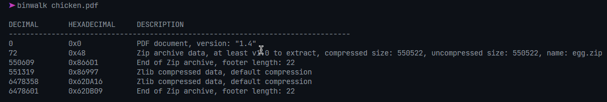

# Description

Download the file and find a way to get the flag.

# Steps

After unzipping the PDF, you'll get a `chicken.pdf` file. At first, it looks like a regular PDF, but `binwalk`ing it yields the following.



Inside `_chicken.pdf.extracted/`, we see an `egg.zip` file. Next, we can use the following to recursively extract `egg.zip`:

```sh
while [ -d "egg.zip" ]; do
    unzip egg.zip -d egg
    cd egg
    unzip chicken.zip -d chicken
    cd chicken
done
```

Once this loop exits, we have an `egg.pdf` file, which has the flag!

```
wh1ch_came_f1rst?
```
