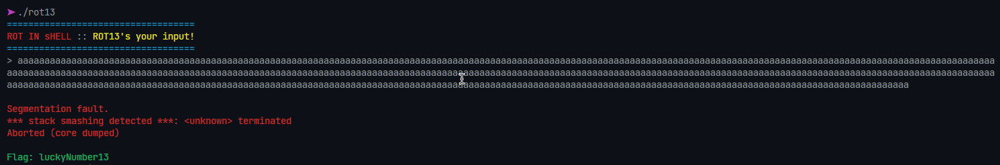

# Description

Download the file and find a way to get the flag.

# Steps

Unzipping the archive gives us a file named `rot13`. Yet another trivial challenge, we can just spam characters (this is a buffer overflow attack) and grab the flag:

