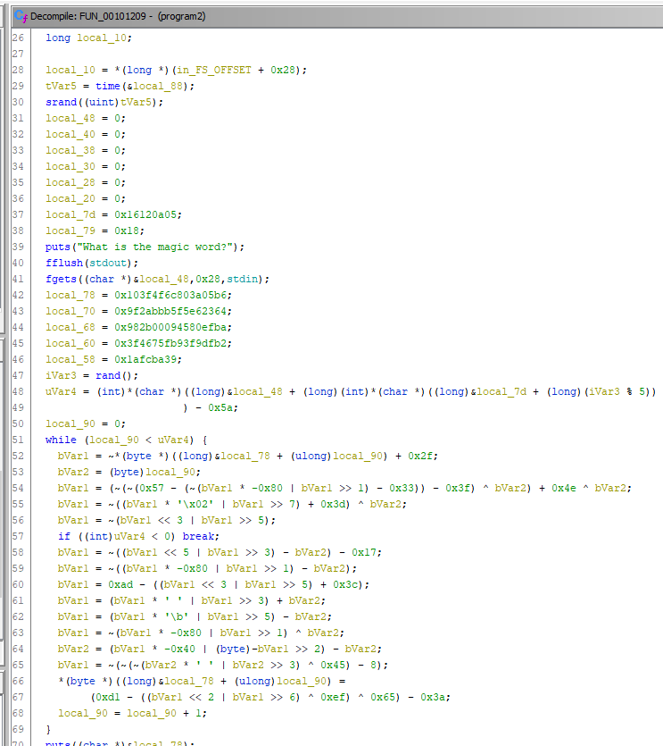
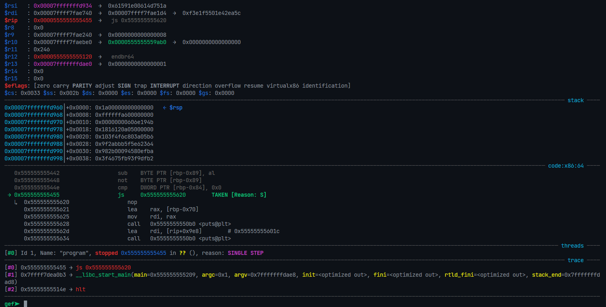
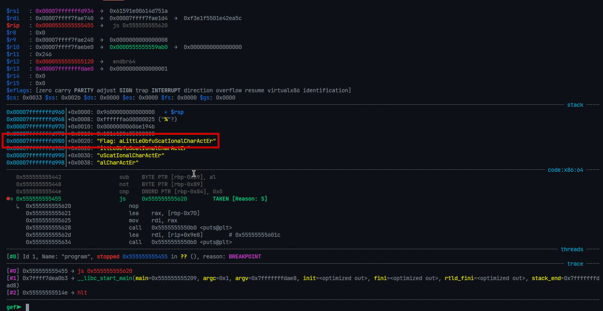

# Description

Download the file and find a way to get the flag.

# Steps

This challenge was a bit more... involved than the others (for me, at least. Apparently there was a much easier way to solve it but whatever, here goes). Running the program with some garbage gives us this:

```
What is the magic word?
fsdafasdfasd
�:�lO?d#����*���E
Did you understand that?
```

Great, even more garbage. Let's open this up in Ghidra:



Yeah this doesn't really look too fun to reverse. Since I'm lazy, I decided I was just going to jump around until the flag got where I wanted it to be. Let's take a look at the core of the loop here: `local_90` is being compared to `uVar4`. If we take a closer look, we see that `uVar4` is completely independent of what we input, since it's computed with the _address_ of `local_48` (see cast of reference to `long`). Same goes for `local_7d` (plus that's a constant, along with `iVar3`). The only way that this loop could be broken is at the conditional `break`, so we'll need to find a way around that. Since this is a PIE executable we'll start it with `entry-break`. We'll break at the function call closest to what we want, which is `rand`. Then, we step through until we reach the break condition.



Notice that we're comparing the value of `uVar4` with 0 here. `cmp` will set the `signed` flag if the value produced by `arg2 - arg1`, is negative (meaning that the MSB is set in the value "returned" by `cmp`. Note that `cmp` and `sub` are identical except for the fact that the difference is not stored in a register). Then, the JS instruction jumps if the signed flag is set. To translate this all to English, we want to jump (break) out of the loop if the first operand (uVar4) is less than the second (0x0). Anyways, all we need to do is overwrite the `eflags` register as needed. The mask of the signed bit is `0x80`, but GEF makes it easy to edit the flag register. We can just type `flag -SIGN`. Now, since we know we're goint to be coming back to this instruction in future iterations, we set a breakpoint on it (in my case, this is at `0x555555555455`). I have defined a function like so:

```
fn work
>flag -SIGN
>si
>flag +SIGN
>continue
```

To make the following steps easier. Now, we can just type `work` and let `*(byte *)((long)&local_78 + (ulong)local_90) = (0xd1 - ((bVar1 << 2 | bVar1 >> 6) ^ 0xef) ^ 0x65) - 0x3a;` fill up our flag for us! Sure enough, we retrieve it:


