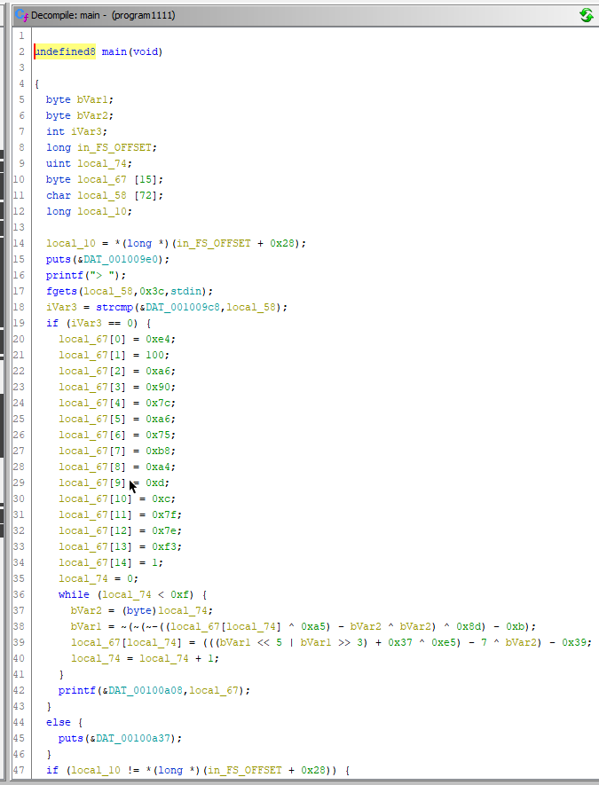
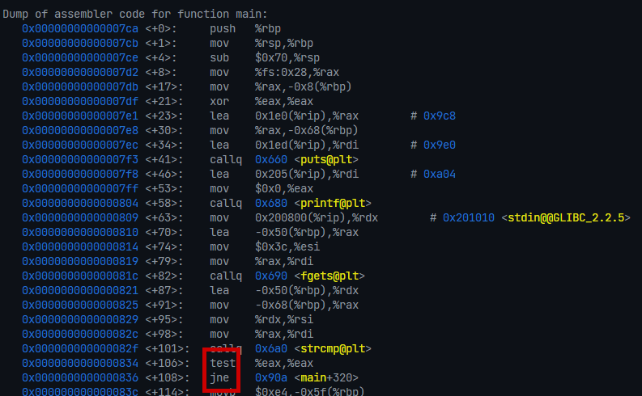
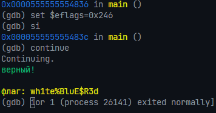

# Description

Download the file and find a way to get the flag.

# Steps

Unzipping the archive gives us a binary named `program`. It seems to accept some sort of text and spit out a response, probably depending on whether the text is equal to some string. This is the decompilation of the `main` function:

I hate reading this stuff and I saw `strcmp` first so I just popped the binary into gdb:

As stated in the x86 calling convention, the integer returned by `strcmp` will be placed in `eax`. The `test` instruction will AND two registers and set `eflags` accordingly. In this case, the thing that's important to us is that if the AND of the two registers equals 0, the zero flag in the `eflags` register is set to `1`. The next instruction, `jne`, is basically an alias for `jnz` and will jump if `ZF` _equals_ 0, meaning the computation resulted in a nonzero value (JNZ stands for "jump if not zero"). The plan of action here is to set the `ZF` bit in `eflags` so we don't jump to the end of the program. Since the mask of the `ZF` bit is `0x40`, we can AND the current value of `eflags` with it and set it in order to escape the jump:

