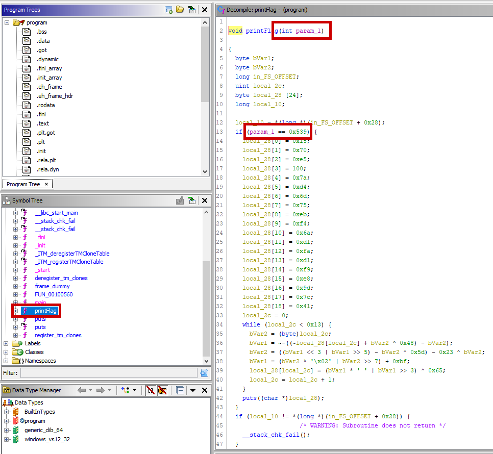

# Description

Download the file and find a way to get the flag.

# Steps

The binary inside this archive isn't very interesting at first, running it just yields the following:

```
I'm not going to make it that easy for you.
```

Well that was lame 🙄 Let's see what we can find in Ghidra:



Great! Let's just call `printFlag` with the argument `0x539`. We'll let GDB take care of the heavy lifting of jumping/setting our registers properly:

```
(gdb) call (void) printFlag (0x539)
Flag: patchItFixIt
```
