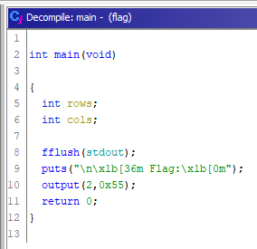
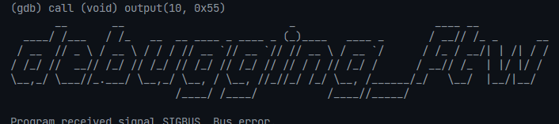

# Description

Download the file and find a way to get the flag.

# Steps

Running the binary gives us this:

```
$ ./flag

Flag:
     __       __                          _                      ____ __
____/ /___   / /_   __  __ ____ _ ____ _ (_)____   ____ _       / __// /_ _      __
Error displaying rest of flag
```

Interesting, let's take a look at the source:



Simple enough. Looks like the first argument to `output` corresponds to the number of rows to be printed. Let's try to call `output` with more rows:


