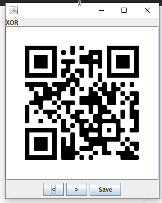

# Description

Download the file and find a way to get the flag.

# Steps

We're given two images; `frame.png`, a QR code, and `code.png`, what looks to be some sort of mask for a QR code. Scanning the first one gives us:

```
Hey, I've put the flag into the other file using the same trick we always use. You know what to do. :)
```

This was a bit misleading at first since I thought that the flag had nothing to do with the `frame.png` file, but I eventually figured you had to use a combination of the two. XORing them in `stegsolve` gives us:



Scanning the resulting QR code gives us the flag: `A_Code_For_A_Code`.
