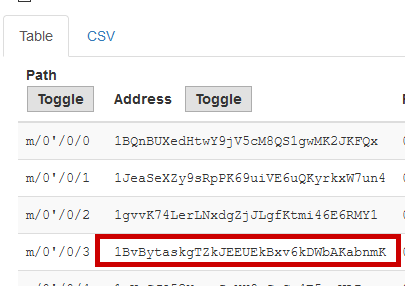

# Description

Complete the missing BIP39 mnemonic seed phrase and get address `3` at BIP32 derivation path `m/0'/0` as the flag.

`nature midnight buzz toe sleep fence kiwi ivory excuse system ____ ______`

You will need to make use of this, as the start of the 128 char BIP39 seed:

`131c553f7fb4127e7b2b346991dd92`

# Steps

This challenge was a bit weird since I've never heard of any of the things mentioned in it. Let's see what we can find online: [https://iancoleman.io/bip39/](https://iancoleman.io/bip39/). We see that a mnemonic phrase is generated, which is transformed into a seed. Then, we are given a list of addresses given some sort of derivation path depending on the BIP version. The process of deriving a seed from a phrase is described quite nicely in this [article](https://bitcoinwords.github.io/how-i-checked-over-1-trillion-mnemonics), which I referenced throughout the challenge.

> BIP-39 does this using a Password-Based Key Derivation Function with HMAC-SHA512 as the hash function, the string “mnemonic” as the salt, and the 12-word mnemonic as the password. It also uses 2048 iterations and each iteration requires two SHA512 calculations. This means this step will cost in total ~4096 SHA-512 calculations.

I see. It looks like we'll need to write a brute for the last two words of the mnemonic. As such, I downloaded the wordlist and began writing my brute forcer:

```js
const bip39 = require("bip39");
const pbkdf2 = require("pbkdf2");
const fs = require("fs");

const BASE = "nature midnight buzz toe sleep fence kiwi ivory excuse system";
const WL = fs.readFileSync("./wl", "utf8").split("\n");
const WL4 = WL.filter((w) => w.length === 4);
const WL6 = WL.filter((w) => w.length === 6);

// the seed we're looking for will start with these bytes
const CMP = Buffer.from([
	0x13,
	0x1c,
	0x55,
	0x3f,
	0x7f,
	0xb4,
	0x12,
	0x7e,
	0x7b,
	0x2b,
	0x34,
	0x69,
	0x91,
	0xdd,
	0x92,
]);

WL4.forEach((w4) => {
	WL6.forEach((w6) => {
		const self = BASE + " " + w4 + " " + w6;
		if (bip39.validateMnemonic(self)) {
			// derive the seed with pbkdf2 (2048 rounds of hashing), 128 characters
			const seed = pbkdf2.pbkdf2Sync(self, "mnemonic", 2048, 64, "sha512");
			// compare seed buffer
			if (seed.slice(0, CMP.length).equals(CMP)) {
				console.log("gotem: " + self);
			}
		}
	});
});
```

Running our brute force gives us: `nature midnight buzz toe sleep fence kiwi ivory excuse system exit filter` as the mnemonic. Its seed is `131c553f7fb4127e7b2b346991dd92821b7a0ee0b1679b15e00d50840d21c01f5781ddf1869f161c04138f4be6760fe593c7acbd0af0741cb7ea092883597cf1`, as we expected! Next, we specify the derivation path of `m/0'/0`, and the third address is the flag!


